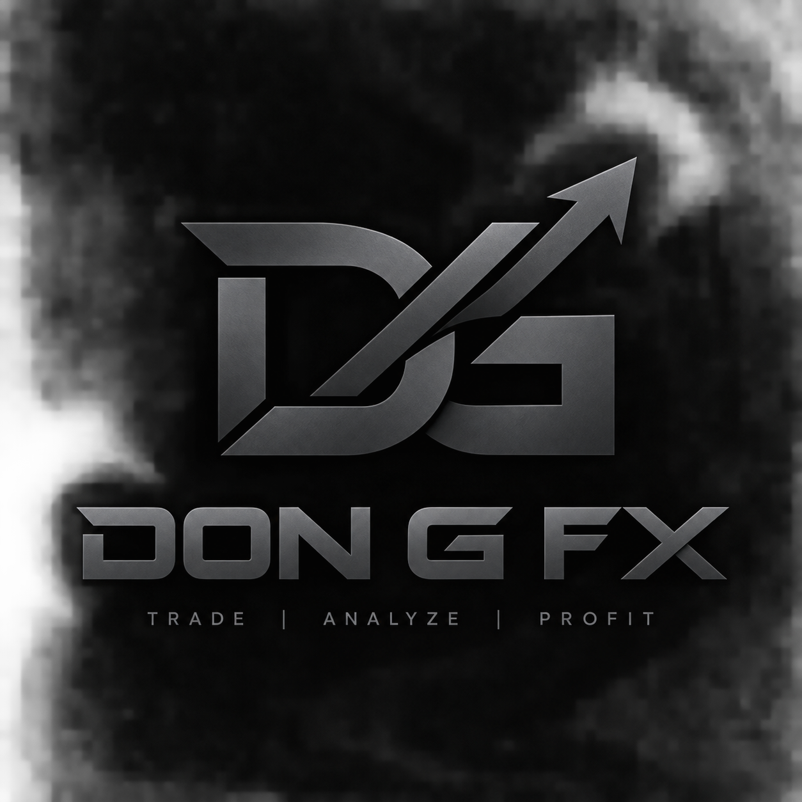

# DON G FX — MT5 Forex & CFD Trader

<p align="center"></p>

**DON G FX** (FORMERLY_PLACEHOLDER("DongGfx" — the `DongGfx.*` assemblies and `DongGfx.exe` binary keep the legacy name) — a WPF desktop application for automated forex/CFD trading on MetaTrader 5 through a loopback bridge, with an autonomous FX brain (regime detection + momentum/mean-reversion families, paper-first soak), an MT5-style terminal surface, and layered real-money safety rails. *Trade | Analyze | Profit.*

> The Deriv binary-options integration (contract trading, multi-account hub, LLM/growth brains, first-run token wizard) has been **removed** — see `docs/real-money-safety-audit.md` for what replaced its rails. MT5/forex is the only trading surface.


[](https://github.com/tashingagwatidzo776-max/ayla/actions/workflows/ci.yml)
[](https://tashingagwatidzo776-max.github.io/ayla/)
[](https://tashingagwatidzo776-max.github.io/ayla/trend.html)
[](https://tashingagwatidzo776-max.github.io/ayla/health-status.html)
[](https://github.com/tashingagwatidzo776-max/ayla/actions/workflows/weekly-bankroll-drill.yml)
[](https://github.com/tashingagwatidzo776-max/ayla/actions/workflows/schedule-watchdog.yml)

## Pipeline health

| What | Where |
|---|---|
| **Live status** | [](https://tashingagwatidzo776-max.github.io/ayla/health-status.html) [health.json](https://tashingagwatidzo776-max.github.io/ayla/health.json) — regenerated by every Pages deploy; `"healthy": true` = coverage gate passing, no open drift issues, and the money axis not stale. Before the axis has any data the badge reflects CI health only. |
| Coverage trend & milestones chart | [trend.html on GitHub Pages](https://tashingagwatidzo776-max.github.io/ayla/trend.html) — one point per successful `main` run, annotated with gate raises and notable episodes |
| Drift alert (nightly failures, missed runs, recovery notes) | [open `ci-drift` issues](https://github.com/tashingagwatidzo776-max/ayla/issues?q=is%3Aissue+is%3Aopen+label%3Aci-drift) — empty means the pipeline is healthy |
| Weekly bankroll drill (Saturdays 05:23 UTC) | [open `ci-bankroll-drill` issues](https://github.com/tashingagwatidzo776-max/ayla/issues?q=is%3Aissue+is%3Aopen+label%3Aci-bankroll-drill) — empty means the artifact-publish path (synthetic trade store → exporter → publisher → Pages CSV → trend page) rehearsed green |
| Scheduler-outage runbook | [`docs/scheduler-outage-runbook.md`](docs/scheduler-outage-runbook.md) — what a no-show verdict means and what to dispatch |
| Drift-alert policy | [`docs/drift-alert.md`](docs/drift-alert.md) — classification, green notes, throttling |

Health checks (nightly 03:17 UTC, weekly dispatch, or manual via **Actions → CI → Run workflow → CI health check**) run the full pipeline and post to the drift issue on both failure *and* recovery, so a glance at the issues list answers "is CI healthy right now?".

## Drill culture

CI here does more than test the code — it **rehearses the paths**: every automated channel that could rot silently gets a scheduled drill that exercises it end-to-end. Failures file as labeled issues through the shared drift-alert machinery, green notes record the recovery, and an empty issue query means the paths are healthy.

| Cadence (UTC) | Drill | What it rehearses |
|---|---|---|
| nightly 03:17 | CI drift | the build / test / coverage-gate pipeline itself; failures and recovery recorded on `ci-drift` |
| daily 06:00 | [Schedule watchdog](.github/workflows/schedule-watchdog.yml) | that last night's scheduled run actually **arrived** (scheduler slots get dropped silently) and that no open drift alert has gone quiet past 48h |
| Mon 06:23 | CI health check | the full pipeline on demand-week cadence; green runs post to the drift issue |
| Wed 05:41 | [Weekly drills](.github/workflows/weekly-drills.yml) | the drift-alert lifecycle itself (fail → alert → green → resolve → staleness flag) against the real API |
| Sat 05:23 | [Weekly bankroll drill](.github/workflows/weekly-bankroll-drill.yml) | the artifact-publish path end-to-end: a synthetic trade store → the real exporter → the real publisher commit + push → the committed CSV parses under the trend page's reader |
| Sat 02:37 | [Real-money gate drill](.github/workflows/gate-drill.yml) | the full real-money gate lifecycle against the fake broker — every `Category=RealMoney` test class (gate decisions, the session unlock latch, the MT5 order rails, the journal/digest audit surfaces); release tags (`v*`) re-rehearse it before anything ships, and failures file on `ci-gate-drill` |

## Features

### Trading
- **MT5 order card** — market/limit/stop/stop-limit orders with optional SL/TP through the loopback bridge (`bridge/mt5_sidecar.py`)
- **FX brain** — autonomous paper-first engine: regime detection, momentum + mean-reversion families, per-symbol engines over `FxSymbols`, alpha scorecard (nightly walk-forward verdicts per family)
- **Paper soak → go-live** — the brain journals signals in paper mode until the per-symbol soak completes; going LIVE is an explicit action
- **MT5-style terminal** — Market Watch (type-to-filter), price ladder, candles, positions/exposure/account-history/journal toolbox

### Risk Management (see `docs/real-money-safety-audit.md`)
- Master kill switch — halts everything and cross-venue flattens open MT5 positions
- `FxSupervisor` before every cycle **and** every order: session daily-loss cap, absolute equity floor, kill switch, portfolio governor, bridge-down; any halt returns the live engine to paper and latches until RE-ARM
- Real-money gate — fail-closed demo/real decision plus a typed-phrase session unlock shared by every trade path
- Lot cap (`Mt5MaxLots`, 0 disables placement), portfolio exposure veto, news blackout window
- Unlock-staleness alert — an armed unlock past `ArmStalenessHours` journals ⏰ + toast + webhook, repeating per threshold

### Monitoring & Notifications
- Windows toast notifications for trade events and risk-rail changes
- Discord/Slack webhook integration with live URL validation + test-post button
- Trade journal with full-text search, date filtering, and dedicated unlock-arm/stale formatting
- Performance dashboard with equity curves, strategy comparison, per-account stats
- Metrics export (CSV + JSON) carrying live cycle telemetry; scheduled cycle-telemetry digest to the webhook (default every 6h), plus a companion GitHub workflow when `METRICS_WEBHOOK_URL` is a repository secret
- Live telemetry panel (cycles, latency mean/p95/max, errors) refreshing every 3 seconds

## Quick Start

### Prerequisites
- Windows 10/11
- [.NET 8.0 SDK](https://dotnet.microsoft.com/download/dotnet/8.0)
- Python 3 (for the MT5 bridge sidecar)
- A MetaTrader 5 terminal — a complete portable copy ships in this tree at `mt5_portable/` (git-ignored; verified against `scripts/mt5-copy.sha256` by `scripts/mt5_copy_integrity.ps1`, which CI runs)

### Build & Run

```bash
# Clone the repository
git clone https://github.com/your-username/tf.git
cd tf

# Build
dotnet build

# Run the app (it launches the pinned MT5 terminal and starts bridge polling)
dotnet run --project src/DongGfx.App

# Start the loopback sidecar (separate console; binds 127.0.0.1 only)
python bridge/mt5_sidecar.py
```

### First Run
1. The app launches the terminal from **Settings → MT5 terminal path** (empty = auto-discover; this repo pins `mt5_portable\terminal64.exe`).
2. Start the sidecar; the Terminal tab's account bar turns from `bridge offline` to your MT5 login/server/balance.
3. Set the FX brain's symbols and caps in **Settings → FX BRAIN**, save, then use **FX BRAIN ON/OFF** on the Terminal account bar. It starts in paper mode.

## Going live — from paper to real

Nothing in the app is live-by accident: the same rails stand at every trade
path, and the unlock is per session (it dies with the process).

1. Run the brain in **PAPER** until the soak completes (the FX badge shows soak progress; all symbols must soak — go-live is all-or-nothing).
2. Confirm the safety settings: `Mt5MaxLots`, `Mt5DailyLossCap`, `Mt5EquityFloor`, `FxPortfolioMaxLots`, news blackout — every one of them fail-closed or bounded.
3. Run the sidecar so the venue's `trade_mode` verdict reaches the gate — a real MT5 account demands the typed session unlock (`TRADE REAL MONEY`) at order time.
4. Arm the unlock, press **GO LIVE**, and keep the webhook on so refusals/arms/staleness reach you out-of-band.

`scripts/soak_report.py` turns a demo session's journal into an evidence
report with pass/fail verdicts — and `--record` accumulates the evidence in
`docs/soak/`, where the weekly drill checks it stays fresh (absent is fine,
stale fails the drill):

```bash
python scripts/soak_report.py --since 2026-09-17 --record docs/soak
# exit 0 = clean · 1 = findings · 3 = NO DATA (an empty soak is not evidence)
git add docs/soak && git commit -m "soak evidence"
```

## Configuration

All settings are stored under `%APPDATA%\tf\data\`:

| File | Purpose |
|------|---------|
| `settings.json` | App settings (FX brain caps, webhook, monitoring, pinned terminal path) |
| `journal/` | Trade journal entries (settlements, MT5 orders, FX risk, unlock audit lines) |
| `logs/` | Structured application logs |
| `news-calendar.json` | High-impact events the brain blackouts around |
| `mt5-bridge.json` | Resolved terminal path + sidecar port shared with watchdog/sidecar |

### FX brain settings

| Setting | Default | Purpose |
|---------|---------|---------|
| `FxSymbols` | `XAUUSDmicro,EURUSD,GBPUSD,USDJPY` | One engine per symbol (paper first) |
| `FxPortfolioMaxLots` | 0.10 | Total open lots across ALL brain symbols (0 disables the veto) |
| `Mt5MaxLots` | 1.00 | Single-order lot ceiling (0 disables MT5 placement — fail closed) |
| `Mt5DailyLossCap` | 25 | Stop (and flatten) when session P/L drops this far below start balance |
| `Mt5EquityFloor` | 0 | Back to paper when MT5 equity falls below this (0 = disabled) |
| `NewsBlackoutMinutes` | 15 | Refuse new brain orders this long before/after high-impact events |
| `Mt5TerminalPath` | *(empty)* | Pinned `terminal64.exe` (empty = auto-discover); honored by startup, watchdog and sidecar |
| `ArmStalenessHours` | 4 | Toast+journal+webhook when an unlock stays armed this long (0 disables) |

## Project Structure

```
tf/
├── bridge/               # MT5 sidecar (Python) — loopback order/history transport
├── src/
│   ├── DongGfx.Core/     # Core library (FX engine, models, journal, analytics)
│   └── DongGfx.App/      # WPF desktop application (terminal, dashboard, rails)
├── mt5_portable/         # In-repo portable MetaTrader 5 (git-ignored, hash-verified)
├── tests/
│   ├── DongGfx.Core.Tests/   # Unit tests (xUnit)
│   └── DongGfx.App.Tests/    # Integration tests (xUnit)
├── scripts/              # CI-local gate, probes, publish, safety checkers
└── .github/workflows/    # CI/CD
```

## Safety Features

- **Demo/paper by default** — the brain starts in paper; real accounts demand the typed session unlock at every trade path
- **Kill switch** — one-click halt of all trading, cross-venue flatten
- **Fail-closed lot cap** — `Mt5MaxLots = 0` refuses placement outright
- **Supervisor stops** — daily-loss cap and equity floor latch until explicit re-arm
- **Loopback-only transport** — the C# bridge client refuses non-loopback base addresses by construction
- CI enforces the audit: `scripts/check_safety_audit.py` (every order-placement call site documented) and `scripts/check_rail_traits.py` (every gate-touching test class traited for the release drill)

Full rail-by-rail coverage: [`docs/real-money-safety-audit.md`](docs/real-money-safety-audit.md).

## Troubleshooting

### "bridge unavailable — run: python bridge/mt5_sidecar.py"
- Start the sidecar; it binds `127.0.0.1:53190` only. Check `data/mt5-bridge.json` if you changed the port.

### The terminal never launches
- Set **Settings → MT5 terminal path** explicitly (`...\mt5_portable\terminal64.exe`), or leave it empty to auto-discover known installs. A `terminal64` process already running counts as launched.

### The brain stays in PAPER
- Expected until the soak completes; the FX badge shows `soak n/m`. GO LIVE is explicit and all-or-nothing across symbols.

### An order is refused with a real-money message
- That is the gate. Demo passes through; a real account needs the session unlock armed (type `TRADE REAL MONEY`), and the staleness watch will nag if it stays armed.

### App won't start
- Ensure the .NET 8.0 SDK is installed, `%APPDATA%\tf\data\` is writable, or delete `settings.json` to reset configuration.

## Contributing

1. Fork the repository
2. Create a feature branch
3. Make your changes
4. Run `pwsh ./scripts/ci-local.ps1` to run the same checks CI will (or enable the pre-push hook once with `git config core.hooksPath scripts/git-hooks`)
5. Submit a pull request

CI runs on every PR and posts a coverage-diff comment (this PR's merged line coverage vs the last successful run on `main`, against the 60% gate); a nightly scheduled run at 03:17 UTC catches drift such as runner/SDK updates and upstream API changes.

## License

MIT License — see [LICENSE](LICENSE) for details.

## Disclaimer

⚠ **This software is for educational and demo purposes only.** Forex/CFD trading carries significant risk of financial loss. Never trade with money you cannot afford to lose. The authors are not responsible for any financial losses incurred through use of this software.
