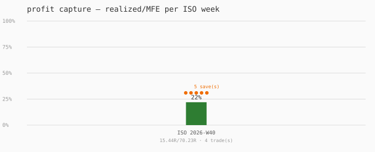



## FX exit weekly digest — 2026-09-28

- evaluations: 162 (override 5 / consensus 157)
- overrides: drawdown ×5
- consensus bands: hold ×146, monitor ×7,  ×4
- exit reasons (decisive): drawdown ×5
- MAE at exit: <0.5R ×0, 0.5–1R ×0, 1–1.6R ×0, ≥1.6R ×5
- round-trips (MFE ≥1R, closed ≤0.2R): 2/5 (40%)

## FX exit weekly digest — 2026-09-28

- evaluations: 165 (override 5 / consensus 160)
- close confirmations (no evaluation): 4
- overrides: drawdown ×5
- consensus bands: hold ×153, monitor ×7
- exit reasons (decisive): drawdown ×5
- MAE at exit: <0.5R ×0, 0.5–1R ×0, 1–1.6R ×0, ≥1.6R ×5
- round-trips (MFE ≥1R, closed ≤0.2R): 2/5 (40%)

## FX exit weekly digest — 2026-09-29

- evaluations: 872 (override 14 / consensus 858)
- close confirmations (no evaluation): 12
- overrides: drawdown ×14
- consensus bands: hold ×834, monitor ×22, tighten ×2
- exit reasons (decisive): drawdown ×14
- MAE at exit: <0.5R ×0, 0.5–1R ×0, 1–1.6R ×0, ≥1.6R ×14
- round-trips (MFE ≥1R, closed ≤0.2R): 6/14 (43%)

## FX exit weekly digest — 2026-09-29

- evaluations: 932 (override 14 / consensus 918)
- close confirmations (no evaluation): 12
- overrides: drawdown ×14
- consensus bands: hold ×894, monitor ×22, tighten ×2
- exit reasons (decisive): drawdown ×14
- MAE at exit: <0.5R ×0, 0.5–1R ×0, 1–1.6R ×0, ≥1.6R ×14
- round-trips (MFE ≥1R, closed ≤0.2R): 6/14 (43%)

## FX exit weekly digest — 2026-09-29

- evaluations: 1050 (override 14 / consensus 1036)
- close confirmations (no evaluation): 12
- overrides: drawdown ×14
- consensus bands: hold ×1012, monitor ×22, tighten ×2
- exit reasons (decisive): drawdown ×14
- MAE at exit: <0.5R ×0, 0.5–1R ×0, 1–1.6R ×0, ≥1.6R ×14
- round-trips (MFE ≥1R, closed ≤0.2R): 6/14 (43%)

## FX exit weekly digest — 2026-09-29

- evaluations: 1161 (override 14 / consensus 1147)
- close confirmations (no evaluation): 12
- overrides: drawdown ×14
- consensus bands: hold ×1123, monitor ×22, tighten ×2
- exit reasons (decisive): drawdown ×14
- MAE at exit: <0.5R ×0, 0.5–1R ×0, 1–1.6R ×0, ≥1.6R ×14
- round-trips (MFE ≥1R, closed ≤0.2R): 6/14 (43%)

## FX exit weekly digest — 2026-09-29

- evaluations: 1544 (override 14 / consensus 1530)
- close confirmations (no evaluation): 12
- overrides: drawdown ×14
- consensus bands: hold ×1506, monitor ×22, tighten ×2
- exit reasons (decisive): drawdown ×14
- MAE at exit: <0.5R ×0, 0.5–1R ×0, 1–1.6R ×0, ≥1.6R ×14
- round-trips (MFE ≥1R, closed ≤0.2R): 6/14 (43%)

## FX exit weekly digest — 2026-09-29

- evaluations: 1566 (override 14 / consensus 1552)
- close confirmations (no evaluation): 12
- overrides: drawdown ×14
- consensus bands: hold ×1528, monitor ×22, tighten ×2
- exit reasons (decisive): drawdown ×14
- MAE at exit: <0.5R ×0, 0.5–1R ×0, 1–1.6R ×0, ≥1.6R ×14
- round-trips (MFE ≥1R, closed ≤0.2R): 6/14 (43%)

## FX exit weekly digest — 2026-09-29

- evaluations: 1592 (override 14 / consensus 1578)
- close confirmations (no evaluation): 12
- overrides: drawdown ×14
- consensus bands: hold ×1554, monitor ×22, tighten ×2
- exit reasons (decisive): drawdown ×14
- MAE at exit: <0.5R ×0, 0.5–1R ×0, 1–1.6R ×0, ≥1.6R ×14
- round-trips (MFE ≥1R, closed ≤0.2R): 6/14 (43%)

## FX exit weekly digest — 2026-09-29

- evaluations: 2440 (override 14 / consensus 2426)
- close confirmations (no evaluation): 12
- overrides: drawdown ×14
- consensus bands: hold ×2402, monitor ×22, tighten ×2
- exit reasons (decisive): drawdown ×14
- MAE at exit: <0.5R ×0, 0.5–1R ×0, 1–1.6R ×0, ≥1.6R ×14
- round-trips (MFE ≥1R, closed ≤0.2R): 6/14 (43%)

## FX exit weekly digest — 2026-09-29

- evaluations: 3149 (override 14 / consensus 3135)
- close confirmations (no evaluation): 12
- overrides: drawdown ×14
- consensus bands: hold ×3110, monitor ×23, tighten ×2
- exit reasons (decisive): drawdown ×14
- MAE at exit: <0.5R ×0, 0.5–1R ×0, 1–1.6R ×0, ≥1.6R ×14
- round-trips (MFE ≥1R, closed ≤0.2R): 6/14 (43%)
- profit capture (realized/MFE, decisive ≥0.5R MFE): 0%

## FX exit weekly digest — 2026-09-29

- evaluations: 3472 (override 14 / consensus 3458)
- close confirmations (no evaluation): 12
- overrides: drawdown ×14
- consensus bands: hold ×3433, monitor ×23, tighten ×2
- exit reasons (decisive): drawdown ×14
- MAE at exit: <0.5R ×0, 0.5–1R ×0, 1–1.6R ×0, ≥1.6R ×14
- round-trips (MFE ≥1R, closed ≤0.2R): 6/14 (43%)
- profit capture (realized/MFE, decisive ≥0.5R MFE): 0%

### Profit brain (FX_PROFIT telemetry)

- reports: 323; floor breaches: 0; avg score: 65
- states: PROFIT_PROTECTED ×256, PROFIT_GIVEBACK_WARNING ×66, PROFIT_DETERIORATING ×1

## FX exit weekly digest — 2026-09-30

- evaluations: 4784 (override 5 / consensus 4779)
- close confirmations (no evaluation): 4
- overrides: drawdown ×5
- consensus bands: hold ×4771, monitor ×8
- exit reasons (decisive): drawdown ×5
- MAE at exit: <0.5R ×0, 0.5–1R ×0, 1–1.6R ×0, ≥1.6R ×5
- round-trips (MFE ≥1R, closed ≤0.2R): 2/5 (40%)
- profit capture (realized/MFE, decisive ≥0.5R MFE): 0%

### Profit-capture trend

- weekly capture: ISO 2026-W40 0% (0R of 46.75R, 2 trade(s))
- spark: █

### Profit brain (FX_PROFIT telemetry)

- reports: 2249; floor breaches: 416; avg score: 66
- states: PROFIT_PROTECTED ×1353, PROFIT_GIVEBACK_WARNING ×470, PROFIT_EXIT_READY ×416, PROFIT_DETERIORATING ×9, PROFIT_CRITICAL ×1

## FX exit weekly digest — 2026-09-30

- evaluations: 4912 (override 2 / consensus 4910)
- close confirmations (no evaluation): 2
- overrides: drawdown ×2
- consensus bands: hold ×4908, monitor ×2
- exit reasons (decisive): drawdown ×2
- MAE at exit: <0.5R ×0, 0.5–1R ×0, 1–1.6R ×0, ≥1.6R ×2
- round-trips (MFE ≥1R, closed ≤0.2R): 1/2 (50%)
- profit capture (realized/MFE, decisive ≥0.5R MFE): 0%

### Profit-capture trend

- weekly capture: ISO 2026-W40 0% (0R of 44.11R, 1 trade(s))
- spark: █

### Profit brain (FX_PROFIT telemetry)

- reports: 2509; floor breaches: 508; avg score: 67
- states: PROFIT_PROTECTED ×1517, PROFIT_EXIT_READY ×508, PROFIT_GIVEBACK_WARNING ×474, PROFIT_DETERIORATING ×9, PROFIT_CRITICAL ×1

## FX exit weekly digest — 2026-09-30

- evaluations: 4982 (override 3 / consensus 4979)
- close confirmations (no evaluation): 3
- overrides: profit-floor ×2, drawdown ×1
- consensus bands: hold ×4978, monitor ×1
- exit reasons (decisive): profit-floor ×2, drawdown ×1
- MAE at exit: <0.5R ×2, 0.5–1R ×0, 1–1.6R ×0, ≥1.6R ×1
- round-trips (MFE ≥1R, closed ≤0.2R): 1/3 (33%)
- profit capture (realized/MFE, decisive ≥0.5R MFE): 12%

### Profit-capture trend

- weekly capture: ISO 2026-W40 12% (10.63R of 89.52R, 3 trade(s))
- spark: █

### Profit brain (FX_PROFIT telemetry)

- reports: 2667; floor breaches: 627; avg score: 66
- states: PROFIT_PROTECTED ×1549, PROFIT_EXIT_READY ×627, PROFIT_GIVEBACK_WARNING ×480, PROFIT_DETERIORATING ×10, PROFIT_CRITICAL ×1

## FX exit weekly digest — 2026-09-30

- evaluations: 5072 (override 2 / consensus 5070)
- close confirmations (no evaluation): 2
- overrides: profit-floor ×2
- consensus bands: hold ×5069, monitor ×1
- exit reasons (decisive): profit-floor ×2
- MAE at exit: <0.5R ×2, 0.5–1R ×0, 1–1.6R ×0, ≥1.6R ×0
- round-trips (MFE ≥1R, closed ≤0.2R): 0/2 (0%)
- profit capture (realized/MFE, decisive ≥0.5R MFE): 23%

### Profit-capture trend

- weekly capture: ISO 2026-W40 23% (10.63R of 45.41R, 2 trade(s))
- spark: █

### Profit brain (FX_PROFIT telemetry)

- reports: 2810; floor breaches: 688; avg score: 66
- states: PROFIT_PROTECTED ×1629, PROFIT_EXIT_READY ×688, PROFIT_GIVEBACK_WARNING ×482, PROFIT_DETERIORATING ×10, PROFIT_CRITICAL ×1

### Giveback engine — promotion review triggered

PROMOTION REVIEW — decisive settled exits 2/100, first verified save: ticket 9820161383 (profit-floor override). Reassess docs/soak/GIVEBACK-PROMOTION-CASE.md (giveback engine: weight 0 until 100 trades @ 60% hit, Monte-Carlo STABLE).

